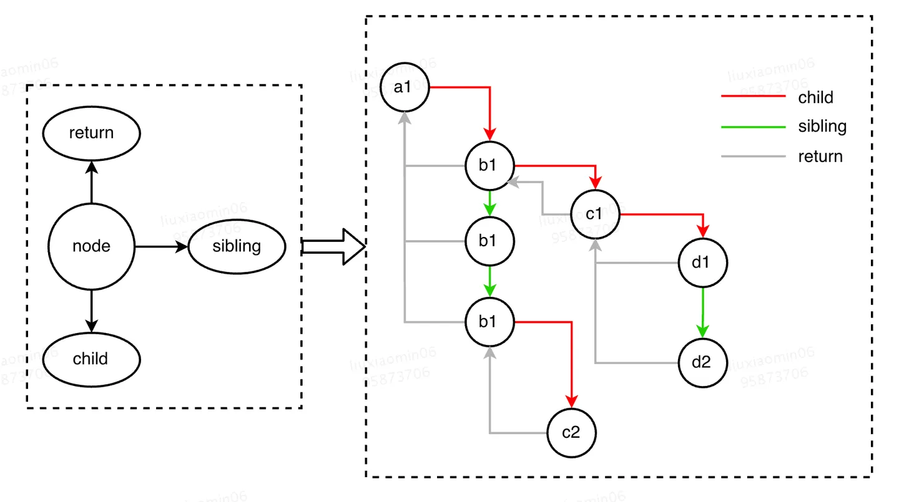

# custom react

根据react的virtual dom写的项目
- 用于学习react的virtual dom


虚拟 DOM（Document Object Model）是在库和框架中（如React）使用的一个概念，
* 用于提高更新用户界面（UI）的效率。
* 其核心思想是创建一个轻量级的内存中表示实际 DOM 结构的虚拟表示
* 对这个虚拟表示进行更新，然后基于这些变化高效地更新实际 DOM。


## 下载依赖
```bash
npm run i
```

## 运行模式
* development
开启liveserver，配置了sourcemap，方便更好学习
```bash
npm run dev
```

* production
混淆压缩代码，没有sourcemap
```bash
npm run build
```

## 初体验
可以给dom添加属性(attribute, property),还有绑定事件
```javascript
const dom = createElement(
    "div",
    {id: "foo"},
    createElement("a", null, "bar"),
    createElement("b"),
    createElement("button", {
        id: "btn",
        onClick: (e:Event) => {
            console.log(e);
        },
    }, "button")
)
```

## 以下是React中虚拟 DOM 的工作原理的简化概述：

1. 初始渲染:
- 当你定义一个React组件并首次渲染时，React会创建UI的虚拟 DOM 表示。
- 这个虚拟表示是一种JavaScript对象的树状结构，它反映了实际 DOM 的结构。

2. 变更和协调:
- 当React组件的状态或属性发生变化时，会创建一个新的虚拟 DOM 树。
- React然后执行一个称为“协调”的过程，以确定新旧虚拟 DOM 树之间的差异（差异算法）。这个过程确定了需要更新的UI的部分。

3. 最小化 DOM 操作:
- 一旦差异被识别出来，React生成了一组最小的变更，用于更新实际 DOM。
- 这种方法有助于最小化对实际 DOM 的直接操作，而这在性能方面是代价高昂的。

4. 批量更新:
- React将多个更新批处理，并在一次遍历中应用它们，以进一步优化性能。这通常使用React Fiber架构等机制来实现。

5. 更新实际 DOM:
- 最后，React使用计算出的最小变更集更新实际 DOM。
- 这种更新通常使用高效的技术，例如批处理更新，以及在支持的情况下使用 requestAnimationFrame API。

---
* 通过使用虚拟 DOM，React旨在提供一种更有效的更新 UI 的方式。它减少了对实际 DOM 的直接操作数量，并有助于改善应用程序的性能，特别是在需要频繁更新 UI 的情况下。

* 请注意，这是一个简化的解释，实际的实现细节可能更复杂。React 的协调算法是确保这一过程高效运行的关键部分，以确保更新以最佳方式执行。

---
## Fiber的调度单元： Fiber Node
通过节点上的 child（孩子）、return（父）和 sibling （兄弟）属性串联着其他节点，形成了一棵 Fiber Tree (类似Virtual DOM tree)
Fiber Tree 是由 Fiber Node 构成的，更像是一个单链表构成的树，便于向上/向下/向兄弟节点转换
```typescript
// fiber node interface
export interface Fiber{
    tag?: string,
    type?: string | ((props:FiberProps) => Fiber),
    // 单链表树结构
    parent?: Fiber,
    child?: Fiber | null,
    sibling?: Fiber | null,
    // 在渲染完成之后他们会交换位置
    alternate?: Fiber | null,
    // 跟当前Fiber相关本地状态（比如浏览器环境就是DOM节点）
    stateNode?: HTMLElement | Text,
    props: FiberProps,
    partialState?: Fiber | null,
    // Effect 相关的
    effectTag?: string,
    hooks?: [],
    dom?: Text | HTMLElement | null,
}
```

- 组件是React 应用中的基础单元，应用以组件树形式组织，渲染组件；
- Fiber 调和的基础单元则是 fiber（调和单元），应用与 Fiber Tree 形式组织，应用 Fiber 算法；
- 组件树和 fiber 树结构对应，一个组件实例有一个对应的 fiber 实例；
- Fiber 负责整个应用层面的调和，fiber 实例负责对应组件的调和；


### TODO
* 完成useState钩子
* html转化成javascript对象
* 实现路由
* 实现状态管理redux
